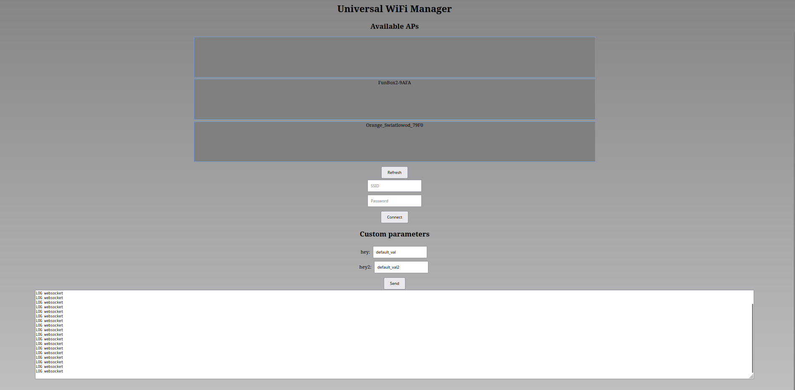

**WiFiManagerEsp32**

WiFiManagerEsp32 is a C++ library inspired by [WiFiManager](https://github.com/tzapu/WiFiManager), designed to retrieve Wi-Fi network credentials and establish a connection to the network upon each restart of the ESP32 board. Notably, it can be utilized seamlessly with both the esp-idf framework and arduino-esp32.

  

# Features
- Operates in STA (Station) mode.
- Supports AP_STA (Access Point + Station) mode.
- Saves credentials in non-volatile flash memory.
- Captive portal that works on Android and Linux.
- Provides the ability to specify custom parameters.
- Displays logs on the Captive portal page.

# Setup on espidf
**Bare espidf**\
**PlatformIO espidf**\
TODO
# Setup on arduino-esp32
**PlatformIO arduino-esp32**\
**Arduino IDE**\
TODO
# How to use
TODO

# Menuconfig
CONFIG_HTTPD_WS_SUPPORT

odpowiednia wartość partycji factory(app), jeden mega to mało